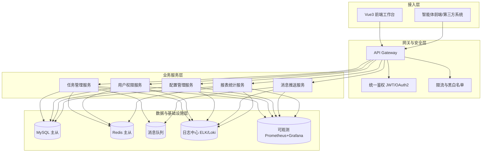
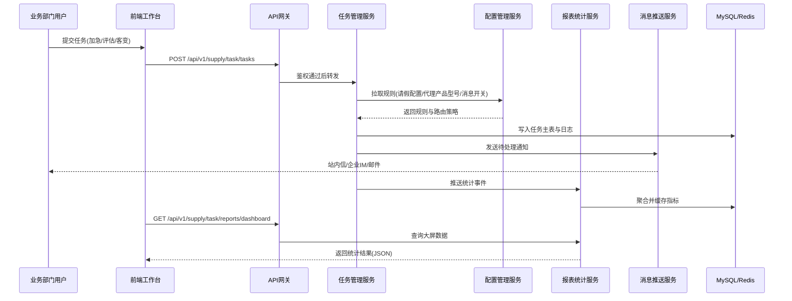

# 供应链统筹任务管理平台

## 第一阶段交付：架构设计基线

## 1. 目标与边界
- 目标：面向电子通讯行业，承接订单加急、未下单交期评估、客期变更等任务在线处理，形成统一任务协同与数据闭环。
- 边界：平台本身负责任务管理与数据接口，不直接承载智能体业务逻辑；智能体前端通过标准接口传入数据。
- 固定约束：
  - 前端沿用公司标准模板与 UI 规范。
  - 后端采用分层微服务架构。
  - 接口统一前缀为 /api/v1/supply/task/，仅支持 JSON。
  - 接口交互需鉴权。
  - 核心服务需高可用部署。

## 2. 分层 + 微服务整体架构图

## 3. 核心模块交互流程图（任务处理主链路）

## 4. 服务职责边界

### 4.1 任务管理服务
- 管理三类主任务：已下单加急、未下单交期评估、客期变更。
- 负责任务生命周期：创建、分派、流转、关闭、归档。
- 维护任务操作日志与状态机校验。

### 4.2 用户权限服务
- 统一账号、角色、权限模型。
- 提供接口鉴权、数据权限、菜单权限校验。

### 4.3 配置管理服务
- 管理请假配置、请假代理产品型号、虚拟产品清单、消息推送开关。
- 输出任务匹配所需配置快照，支持灰度生效。

### 4.4 消息推送服务
- 统一消息模板、渠道、重试策略。
- 对接任务服务触发自动通知，记录投递状态。

### 4.5 报表统计服务
- 负责数据大屏与统计报表。
- 汇总任务时效、积压、准时率、异常率等指标。

## 5. 接口交互规范

## 5.1 REST 规范
- 统一前缀：/api/v1/supply/task/
- 数据格式：application/json
- 资源命名：复数名词 + 小写中划线，例如 /tasks、/leave-configs。
- 幂等要求：更新类接口需业务幂等键（如 requestId）。

## 5.2 统一返回结构
- code：业务状态码，0 为成功，非 0 为失败。
- data：业务数据。
- message：提示语。
- traceId：链路追踪 ID。

示例：
{
  "code": 0,
  "data": {
    "taskId": "TK202603200001"
  },
  "message": "success",
  "traceId": "8f1b9b4a6a3f4f5d"
}

## 5.3 安全与合规
- 必须鉴权：网关层统一校验 JWT/OAuth2 Token。
- 必须审计：关键操作记录操作人、前后值、时间戳、来源。
- 必须脱敏：手机号、邮箱、客户信息按权限返回。

## 6. 高可用与稳定性方案

## 6.1 部署要求
- 核心服务副本数不小于 2。
- 网关多实例 + 负载均衡。
- MySQL 主从 + 读写分离，Redis 主从 + 哨兵。

## 6.2 可靠性保障
- 关键链路加重试与降级（消息推送、报表聚合）。
- 缓存热点数据（配置快照、看板指标）并设置合理 TTL。
- 分布式日志与指标统一接入，建立告警阈值。

## 6.3 可观测性
- 统一 traceId 贯穿网关、服务、数据库访问。
- 监控维度：接口 QPS、成功率、P95/P99、队列堆积、慢 SQL。
- 告警策略：可用性、性能、异常量、消息失败率。

## 7. 第一阶段输出结论
- 当前已完成：整体架构、核心流程、服务边界、接口规范、高可用基线定义。
- 下一阶段建议：进入数据库逻辑模型与物理表结构设计（按模块细化字段、索引、约束、分表策略）。
