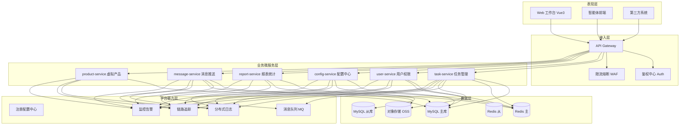
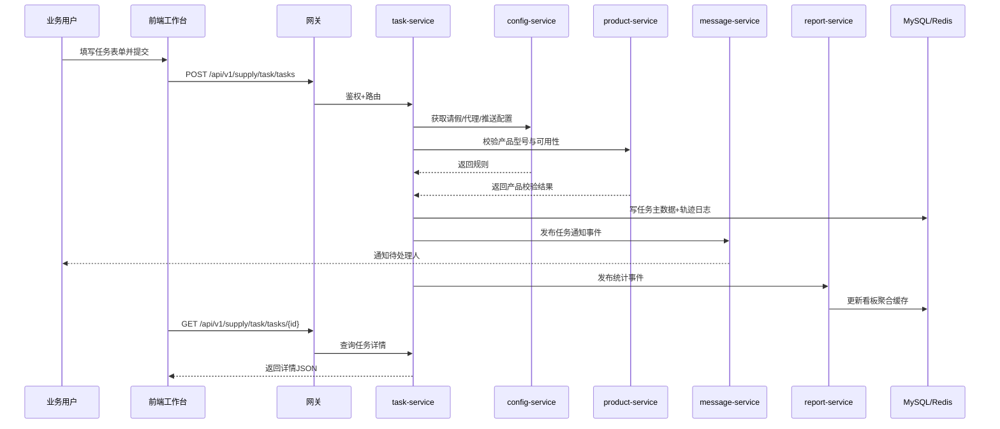
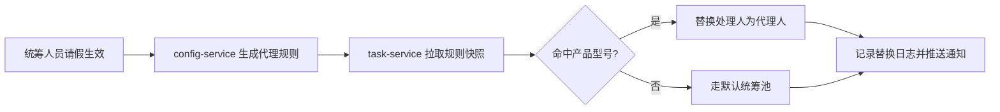

# 供应链统筹任务管理平台

## 第二阶段交付：整体项目架构设计

## 1. 设计目标
- 面向电子通讯行业任务协同场景，承载高频任务流转与跨部门协同。
- 对外统一 API，支持智能体前端与业务系统稳定接入。
- 满足企业级要求：可扩展、可审计、可观测、高可用。

## 2. 技术架构总览

### 2.1 技术选型（建议基线）
- 前端：Vue3 + TypeScript + 公司标准 UI 组件库 + ECharts。
- 网关：Spring Cloud Gateway（或 Kong/APISIX）。
- 后端：Spring Boot + Spring Cloud（微服务治理）。
- 注册配置：Nacos（或 Consul）。
- 数据库：MySQL 8.x（InnoDB）。
- 缓存：Redis（主从+哨兵）。
- 消息：RabbitMQ（或 Kafka，按吞吐要求切换）。
- 任务调度：XXL-Job（定时统计、补偿、重试）。
- 可观测：Prometheus + Grafana + Loki/ELK + SkyWalking/Zipkin。

### 2.2 分层微服务架构图

## 3. 微服务拆分与职责边界

### 3.1 task-service（任务管理）
- 管理任务主域：
  - 已下单加急任务。
  - 未下单交期评估任务。
  - 客期变更任务。
- 提供任务 CRUD、状态流转、转派、催办、关闭、归档。
- 维护操作日志、流转轨迹、附件关联。

### 3.2 user-service（用户权限）
- 账号、角色、权限、组织关系管理。
- Token 校验、数据权限过滤（按角色/部门/产品线）。

### 3.3 config-service（配置管理）
- 请假配置。
- 请假代理产品型号管理。
- 消息推送开关。
- 统筹匹配策略参数（权重、优先级、兜底规则）。

### 3.4 report-service（报表统计）
- 数据大屏指标聚合。
- 报表维度统计（按任务类型、产品型号、责任人、时效）。
- 离线汇总与缓存预热。

### 3.5 message-service（消息推送）
- 消息模板管理。
- 多渠道推送（站内信/IM/邮件/短信）。
- 重试补偿、死信处理、投递回执管理。

### 3.6 product-service（虚拟产品）
- 虚拟产品型号清单维护。
- 产品属性、适配组织、有效期管理。
- 为任务匹配和评估提供主数据支持。

## 4. 业务交互流程

### 4.1 任务提交与流转（统一主流程）

### 4.2 请假代理替换流程

## 5. API 设计规范

### 5.1 统一约束
- BasePath：/api/v1/supply/task/
- Content-Type：application/json
- 字符集：UTF-8
- 时间格式：ISO-8601（例如 2026-03-20T14:30:00+08:00）
- 分页参数：pageNo、pageSize、sortBy、sortOrder

### 5.2 标准返回模型
{
  "code": 0,
  "data": {},
  "message": "success",
  "traceId": "e9af2d3b19f44d7d"
}

### 5.3 状态码建议
- 0：成功。
- 1001：参数校验失败。
- 1002：鉴权失败。
- 1003：无权限。
- 2001：任务状态不允许该操作。
- 3001：配置缺失或冲突。
- 5000：系统异常。

### 5.4 核心接口清单（摘要）
- 任务域：
  - POST /tasks 创建任务
  - GET /tasks 查询任务列表
  - GET /tasks/{id} 查询详情
  - PUT /tasks/{id} 更新任务
  - POST /tasks/{id}/transfer 转派
  - POST /tasks/{id}/close 关闭
- 配置域：
  - GET /configs/leave 请假配置查询
  - PUT /configs/leave 请假配置更新
  - GET /configs/agents 代理产品规则查询
  - PUT /configs/agents 代理产品规则更新
  - PUT /configs/message-switch 消息开关更新
- 报表域：
  - GET /reports/dashboard 大屏指标
  - GET /reports/task-statistics 任务统计
- 用户域：
  - GET /users
  - GET /roles
  - PUT /users/{id}/roles

## 6. 数据与存储架构（设计级）

### 6.1 库表规划原则
- 按服务拆库优先，避免跨域强耦合。
- 表名前缀按模块区分（t_task_*, t_user_*, t_cfg_*, t_msg_*, t_rpt_*, t_product_*）。
- 核心表统一审计字段：created_at、updated_at、created_by、updated_by、is_deleted。

### 6.2 读写与缓存策略
- 读写分离：写主库、读从库；关键一致性读可回源主库。
- 缓存策略：
  - 配置类数据使用 Cache Aside。
  - 报表指标采用定时预计算+短 TTL。
  - 热点任务列表使用分页游标缓存。

### 6.3 性能与容量建议
- 高频查询字段建立组合索引（任务状态+责任人+更新时间）。
- 大表按时间或业务域分区/分表（按月或按任务类型）。
- 归档策略：已关闭任务按生命周期归档至冷表。

## 7. 高可用与容灾设计

### 7.1 服务可用性
- 核心服务副本不少于 2，跨可用区部署。
- 网关无状态化，支持弹性扩缩容。
- 服务治理启用熔断、隔离、限流。

### 7.2 数据可用性
- MySQL 主从复制 + 自动故障切换。
- Redis 哨兵集群 + 持久化策略（AOF+RDB）。
- MQ 开启持久化与镜像队列。

### 7.3 灾备与恢复
- RPO 目标：<= 5 分钟。
- RTO 目标：<= 30 分钟。
- 每日全量备份 + 每小时增量备份。

## 8. 安全与审计设计
- 接口鉴权：JWT/OAuth2，网关统一校验。
- 数据权限：按角色+组织+产品线三维控制。
- 传输安全：全链路 HTTPS，内部服务双向 TLS（可选）。
- 审计日志：关键操作（创建、分派、关闭、配置变更）全量留痕。
- 合规脱敏：手机号、客户信息、账号信息按最小权限原则返回。

## 9. 可观测与运维设计
- 指标监控：QPS、错误率、P95/P99、慢 SQL、缓存命中率、MQ 堆积。
- 日志规范：统一 JSON 日志格式，强制携带 traceId、userId、tenantId（如有）。
- 链路追踪：跨网关与微服务链路贯通。
- 告警分级：P1（服务不可用）、P2（性能劣化）、P3（功能异常）。

## 10. 开发与发布架构

### 10.1 环境分层
- dev：开发联调。
- sit：系统集成测试。
- uat：业务验收。
- prod：生产环境。

### 10.2 发布策略
- 蓝绿/滚动发布二选一，核心服务支持灰度。
- 数据变更遵循“先兼容后清理”的双版本策略。
- 网关路由与配置中心支持动态刷新。

## 11. 前后端代码组织建议

### 11.1 前端目录建议（沿用现有模板）
- src/views/tasks：任务提交、列表、详情。
- src/views/config：请假配置、代理产品、消息开关。
- src/views/reports：大屏与统计报表。
- src/api/modules：按业务域封装 API。
- src/components/business：业务复用组件（任务卡片、状态标签、流程时间线）。

### 11.2 后端目录建议（按服务）
- supply-task-task-service
- supply-task-user-service
- supply-task-config-service
- supply-task-report-service
- supply-task-message-service
- supply-task-product-service

单服务分层结构：
- controller：对外 API。
- service：业务编排。
- manager/domain：领域逻辑与聚合。
- mapper/repository：数据访问。
- model：实体与 DTO/VO。
- infra：外部集成（MQ、缓存、三方接口）。

## 12. 里程碑建议（与后续交付衔接）
- M1：架构评审与接口清单冻结。
- M2：数据库逻辑模型与物理建表脚本完成。
- M3：核心 API 与前端页面联调完成。
- M4：报表与消息链路压测完成。
- M5：UAT 与上线切换。

## 13. 本阶段结论
- 已形成可执行的整体项目架构方案，满足“分层微服务 + 统一接口 + 鉴权合规 + 高可用”硬性约束。
- 可直接进入下一步：按模块输出 MySQL 详细建表方案与初始化脚本。

## 14. 系统管理模块扩展
- 系统管理模块已独立设计，详见 ./docs/10-系统管理模块架构与流程.md。
- 该模块覆盖菜单、字典、角色、用户、日志，并提供页面/按钮/数据/字段四层权限治理。
- 接口前缀统一为 /api/v1/supply/system/，与任务域接口解耦，满足可复用和易扩展要求。
