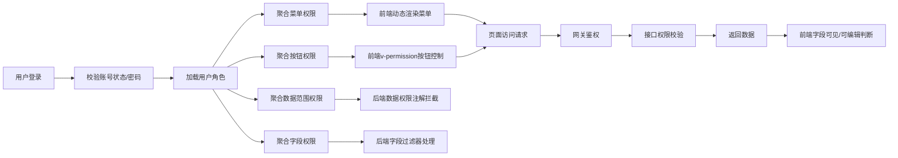
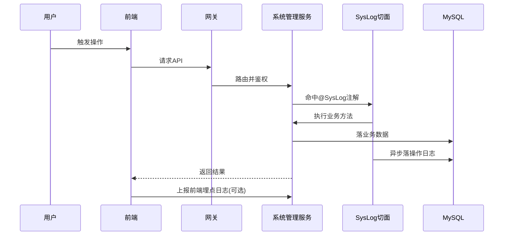
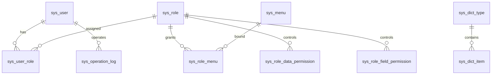

# 系统管理模块架构与流程

## 1. 模块融合方案
系统管理模块作为平台基础服务，独立为 supply-system-service，向其他服务输出统一能力：
- 菜单与按钮权限服务。
- 角色、数据权限、字段权限服务。
- 用户与账号安全服务。
- 数据字典全局服务。
- 操作日志采集与检索服务。

## 2. 权限校验流程图

## 3. 系统日志记录流程图

## 4. 核心表关联关系图

## 5. 设计说明
- 多角色权限叠加：菜单/按钮权限取并集，数据范围权限取最宽集合策略，字段权限按优先级合并（可编辑 > 可见 > 不可见）。
- 字段级权限实现：在 Service 层返回前通过字段过滤器对 VO 字段进行裁剪；查询层配合 SQL 拦截器减少无效字段读取。
- 日志性能：核心操作日志异步写入，查询按时间与模块建立复合索引。
- 缓存策略：用户权限缓存 30 分钟，角色变更后支持主动刷新缓存。
