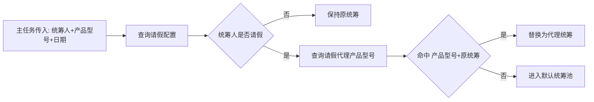
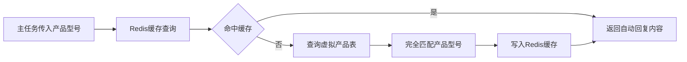
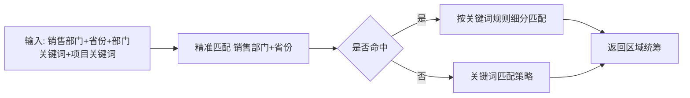
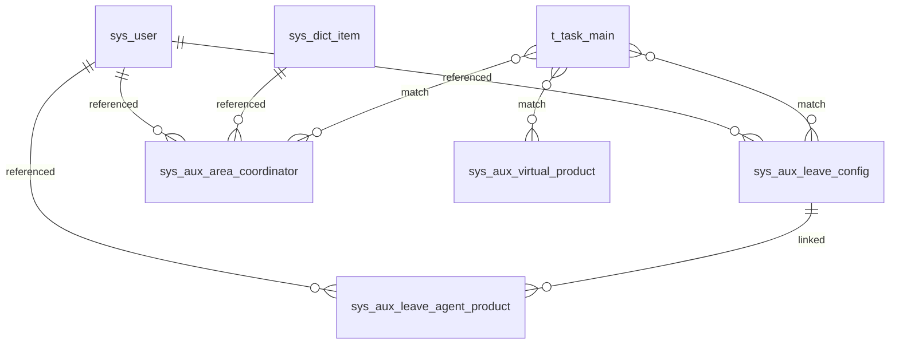

# 辅助功能模块架构与流程

## 1. 融合方案
- 辅助功能模块归属系统管理服务 `supply-system-service` 下的子域。
- 对外统一接口前缀：`/api/v1/supply/system/aux/`。
- 五类子模块：请假配置、虚拟产品、消息推送、请假代理产品型号、区域统筹划分。
- 主要功能模块通过“匹配接口”引用辅助数据，避免重复维护。

## 2. 数据关联流程图

### 2.1 请假配置 -> 代理产品 -> 主任务匹配

### 2.2 虚拟产品匹配流程

### 2.3 区域统筹匹配流程

## 3. 核心表关联关系图

## 4. 关键规则
- 请假时间同一人员不允许重叠。
- 请假代理产品：`product_model + original_user_id` 唯一。
- 虚拟产品型号完全匹配，不做模糊替代。
- 区域统筹匹配优先级：精准 > 关键词。
- 所有导入导出、开关变更、匹配调用均可记录系统日志。
