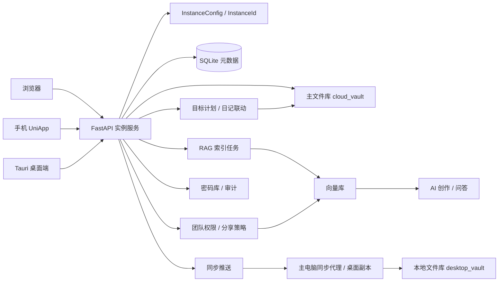

# 整体架构与实例边界

## 1. 架构目标

- 支持个人版与团队版两种商业形态。
- 支持桌面主机部署与服务器中心部署两种运行模式。
- 所有部署实例均通过 `InstanceId` 唯一标识，实例之间天然隔离。
- Web、桌面端、移动端共用同一套后端服务与权限边界。
- AI、RAG、同步、分享均以实例维度做隔离与治理。

## 2. 实例化部署模型

### InstanceId

- 每次首次启动自动生成唯一 `InstanceId`。
- `InstanceId` 作为整套部署环境的业务根标识。
- 后端配置、用户、空间、邀请、分享策略、AI 配置均归属于同一实例。

### 部署模式

- `desktop`：以某台主电脑为中心，电脑不关机时提供局域网同步与 Web 能力。
- `server`：以服务器为中心，统一存储与同步；每个知识库主电脑保留本地副本。

### 商业版本

- `personal`：单实例单用户，默认开放全端基础能力。
- `team`：单实例多用户多空间，需要授权码激活。

## 3. 两种部署拓扑

### 电脑端主机模式

1. 主电脑运行 API、桌面端代理、本地文件库与本地 SQLite。
2. Web 端和局域网内其他设备均连接主电脑提供的 API。
3. 若主电脑关闭，Web 与局域网协作入口不可用。
4. 主电脑同时承担第一存储节点和同步编排节点。

### 服务器中心模式

1. 服务器运行统一 API、同步编排、RAG 索引与主文件库。
2. Web、移动端、桌面端均直连服务器实例。
3. 每个知识库主电脑额外保留本地副本，作为第二份备份。
4. 团队协作、成员管理、公开范围控制都由服务器实例统一裁决。

## 4. 核心领域对象

- `InstanceConfig`：记录实例名、部署模式、版本类型、授权状态。
- `KnowledgeSpace`：用户专属知识空间，可扩展为更多团队空间。
- `TeamMembership`：实例内成员、角色与成员默认公开策略。
- `TeamInvite`：管理员生成的邀请码或邀请链接。
- `NoteAccessPolicy`：笔记级公开策略，决定谁可见、谁可被 RAG 检索到。
- `PasswordVaultConfig`：密码库是否已初始化及其校验状态。
- `PasswordVaultEntry`：密码条目元数据、共享范围和加密后的密文载荷。
- `PasswordAccessAudit`：密码查看、复制等敏感操作审计轨迹。
- `GoalRecord`：目标主记录，承载愿景、关键结果、周期和进度。
- `GoalPlanRecord`：目标的阶段拆解结果。
- `GoalTaskRecord`：阶段下的可执行任务，支持今日任务视角。
- `GoalJournalEntry`：和日记笔记联动的复盘记录。

## 5. 权限与公开范围

### 个人版

- 默认单用户，不需要团队授权码。
- 所有笔记、搜索、RAG、同步都按当前单实例单用户处理。

### 团队版

- 管理员通过授权码激活团队版。
- 管理员可发邀请链接，新增成员进入同一实例。
- 每个成员拥有默认专属空间。
- 每篇笔记默认私有，可切换为：
  - `private`：仅作者与管理员可见。
  - `team`：团队成员可见，并参与团队 RAG 召回。
  - `selected`：仅作者、管理员和指定成员可见。

## 6. 数据与同步策略

### 文件层

- `cloud_vault/`：实例主文件库。
- `desktop_vault/`：桌面主机或知识库主电脑本地副本。

### 元数据层

- SQLite 保存用户、空间、邀请、笔记、标签、双链、RAG chunk、同步事件、分享策略等。

### 同步原则

- 所有变更先进入实例中心节点。
- 中心节点写主文件库与元数据，再广播同步事件。
- 桌面副本异步 ack，形成第二份可恢复副本。
- 团队版同步与检索均按 `NoteAccessPolicy` 过滤。

## 7. AI 与 RAG 隔离

- AI Provider 配置绑定实例，不跨实例共享。
- RAG 检索仅召回当前用户有权限访问的笔记。
- 团队公开笔记才允许被团队其他成员搜索与召回。
- 目标拆解默认优先走实例绑定的 AI Provider；若远端模型不可用，后端回落到本地兜底拆解逻辑。

## 8. 密码管家与目标日记联动

### 密码管家

1. 用户先初始化密码库，主密码仅用于派生密钥。
2. 后端使用实例维度和主密码派生 AES-GCM 密钥，对条目密码做加密存储。
3. 条目元数据可参与统一搜索，但明文密码必须在通过主密码校验后才可读取。
4. 查看、复制等敏感操作会写入审计表，供后续排查与行为追踪。

### 目标计划与日记联动

1. 用户创建目标后，可由 AI 或本地兜底逻辑拆解出阶段计划草案。
2. 阶段计划继续细化为任务，今日任务在首页和日记页都有视图。
3. 任务切换为完成时，系统会同步更新对应的今日日记标记行。
4. 复盘保存时，会回写到 05_Daily 下对应日期的 Markdown 笔记。

## 9. 服务拆分建议

- `api`：统一 REST / WebSocket 接口与实例权限裁决。
- `sync_orchestrator`：同步事件编排、冲突处理、ack 状态机。
- `vault_indexer`：Markdown、标签、双链与图谱索引。
- `rag_worker`：分块、向量化、权限过滤后召回。
- `desktop_agent`：主电脑副本同步、局域网发现与离线补偿。
- `password_manager`：主密码校验、密钥派生、密码生成与加解密。
- `goal_journal_sync`：目标任务状态和今日日记内容之间的同步逻辑。

## 10. 关键接口

- `GET /api/v1/instance/config`
- `PUT /api/v1/instance/bootstrap`
- `GET /api/v1/instance/spaces`
- `POST /api/v1/instance/team/invites`
- `POST /api/v1/instance/team/invites/accept`
- `GET /api/v1/instance/team/members`
- `PUT /api/v1/notes/{slug}/sharing`
- `GET /api/v1/search`
- `GET /api/v1/search/unified`
- `POST /api/v1/rag/query`
- `GET /api/v1/passwords/config`
- `POST /api/v1/passwords/config/setup`
- `POST /api/v1/passwords/config/verify`
- `POST /api/v1/passwords`
- `POST /api/v1/passwords/{entry_id}/reveal`
- `GET /api/v1/passwords/{entry_id}/audits`
- `POST /api/v1/goals/ai/plan`
- `GET /api/v1/goals/overview`
- `POST /api/v1/goals`
- `POST /api/v1/goals/{goal_id}/plans`
- `POST /api/v1/goal-tasks`
- `POST /api/v1/goal-tasks/{task_id}/toggle`
- `PUT /api/v1/goal-journals`

## 11. Mermaid 流程图

